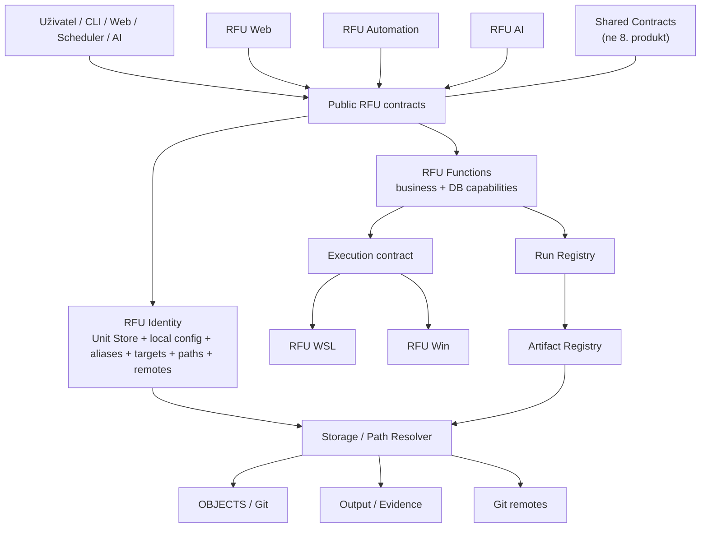
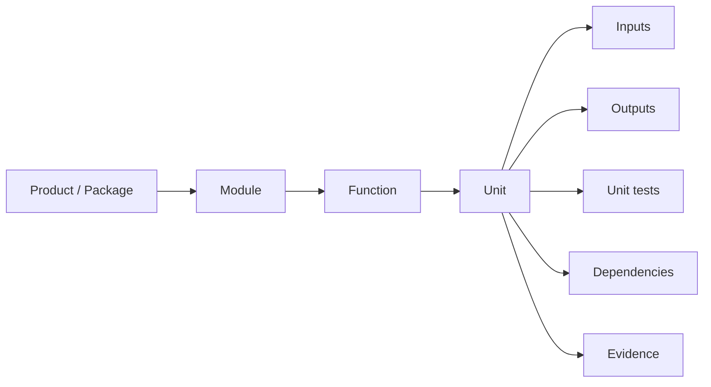
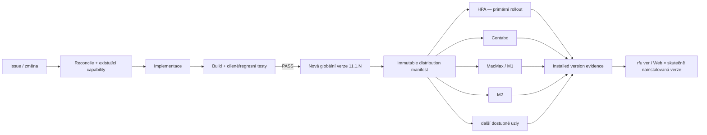

# Řídící přehled RFU

`DOCUMENT_ID=RFU-RIDICI-PREHLED`  
`STATUS=CURRENT`  
`CREATED=2026-09-21`  
`LAST_APPROVED=2026-09-25`  
`APPROVAL_SOURCE=Roman / chat + #252 + communication-governance + incremental-distribution 2026-09-25`  
`AUTHORITY=HIGHEST_HUMAN_READABLE_RFU_OVERVIEW`

> **Účel:** nejkratší místo, kde má být vidět, **co RFU znamená, z čeho se skládá, jak se vyvíjí/testuje, co je alias, co je opravdu BLOCK a kde máme rozpory**.  
> Sémantická změna tohoto dokumentu se schvaluje. Při rozporu se nic důležitého nepřepíše potichu — vypíše se rozpor + doporučené řešení + scope a schválí se finální význam.

---

## 1. Deset hlavních pravidel

1. RFU má **7 runtime produktů**; Shared Contracts nejsou osmý produkt.
2. Hierarchie je **Product/Package → Module → Function → Unit**.
3. **Konfigurace je lokální**; Git drží schema/default/template, ne provozní secrets.
4. O targetu, cestě, remote a runtime bindingu rozhoduje **RFU Identity + Unit Store/registry**.
5. Fyzické cesty uvedené níže jsou **výchozí hodnoty**, nikoli právo modulu je hard-codeovat.
6. Exact Package/Module/Function/Unit verze jsou po publikaci **immutable**.
7. `TESTED_LOCAL`, `TESTED_TARGET` a `ACCEPTED` zůstávají auditní evidence, **nejsou však distribuční/runtime gate** pro průběžnou řadu RFU 11.1.x.
8. Nová průběžná distribuce vznikne po build/test PASS, dostane další globální verzi `11.1.N` a po instalaci je rovnou `RUNNABLE`; funkce se neblokují jen kvůli chybějícímu candidate/test/acceptance označení.
9. **BLOCK se vztahuje jen na nejmenší postižený scope**; nezávislá práce pokračuje.
10. DB write/repair je defaultně zakázán; write vyžaduje explicitní kontrakt/approval/`--AC`.

---

## 2. Architektura RFU

### 7 balíků

| # | Balík | Vlastní hlavně |
|---:|---|---|
| 1 | **RFU Functions** | Function/Module identity, DBGit, Compare, Check/Audit, Backup a backend semantics |
| 2 | **RFU WSL** | Linux/WSL runtime, execution adapter, install/upgrade/rollback |
| 3 | **RFU Win** | Windows runtime, PowerShell/CMD/EXE, Windows install/integrace |
| 4 | **RFU Web** | UI/routes/presentation; volá Functions, neduplikuje business logiku |
| 5 | **RFU Automation** | scheduler, background orchestrace, retry/lease/run correlation |
| 6 | **RFU AI** | provider/model registry, AI request/result orchestrace |
| 7 | **RFU Identity** | Unit Store, target/node/config/path/remote identity, aliasy, readiness, secret refs |

---

## 3. Hierarchie až na Unit

- **Package** = distribuční a vlastnická hranice.
- **Module** = skupina implementace/capabilities.
- **Function** = spustitelná schopnost s Function-ID/Version.
- **Unit** = nejmenší samostatně identifikovatelná a testovatelná implementační jednotka.

Každá Unit má mít minimálně:  
`UNIT_ID | VERSION | OWNER_PACKAGE | OWNER_MODULE | SOURCE/HASH | INPUTS | OUTPUTS | DEPENDENCIES | TESTS | SIDE_EFFECTS | STATUS`.

---

## 4. Lokální konfigurace a cesty

**Runtime autorita:** `RFU Identity + Unit Store + local registry/config`.

| Logická identita | Výchozí hodnota dnes |
|---|---|
| `path.git` | `C:\git\rfu` / `/mnt/c/git/rfu` |
| `path.objects` | `C:\git\rfu\OBJECTS` / `/mnt/c/git/rfu/OBJECTS` |
| `path.output` | `C:\RFU_export` / `/mnt/c/RFU_export` |
| PRIMARY Git | GitHub `rosimcxi/rfu`, `main`, `OBJECTS/` |

**Pravidlo:** Function/Unit žádá o logickou identitu → Identity/Unit Store vyhodnotí lokální config → resolver vrátí skutečný target/path → evidence uloží **logical ID i resolved value**.

Do Git nepatří plaintext hesla/tokeny/privátní lokální config.

**HISTORICAL_ONLY pro nové zápisy:** `D:\_Cloud\GIT\...`, `sen-db/OBJECTS`, `/home/fiser/src/RFU-Linux`, `D:\RFU_EXPORT`, `/mnt/d/RFU_EXPORT`, `/tmp` jako final durable cíl.

---

## 5. Targety, scope a aliasy

### DB scope

`senall = eg, ns, poslanci, pssenat, publsenat`  
Web používá **jeden** selector `Database / scope`, default `senall`.

| Alias / název | Kanonický význam |
|---|---|
| `ALL` | `senall` (legacy alias) |
| `--database ALL` | `--s_db senall` |
| `--database <db>` | `--db <db>` |
| `sendb` | INVALID — neodhadovat |

### PostgreSQL

`DEV_INT, DEV_EXT, ACC_INT, ACC_EXT, TEST, PROD_INT, PROD_EXT`

- `ALL_REMOTE` = všechny registry-resolved, eligible, policy-allowed remote PG targety.
- `DEV_EXT_OLD` = **HISTORICAL_ONLY**, nesmí vstoupit do `ALL_REMOTE`.
- `TEST_INT -> TEST` = deprecated alias.
- `REGISTERED != READY`; PROD jméno samo neznamená provozní připravenost.
- `eg` na EXT = `INELIGIBLE/SKIP_POLICY`, ostatní DB pokračují.

### Informix

`INX_ACC_INT, INX_ACC_EXT, INX_PROD_INT, INX_PROD_EXT`

- `INX_INT -> INX_ACC_INT` = compatibility alias, ne druhá config autorita.
- EXT + `eg` = `INELIGIBLE/SKIP_POLICY`.

### Git remotes

Default selector: `ALL_CONFIGURED_REMOTES`.

Providery: **GitHub, GitLab, Bitbucket, Azure DevOps**.  
Role: `PRIMARY | MIRROR | BACKUP | BUILD | DR`.  
PRIMARY dnes = GitHub `rosimcxi/rfu:main:OBJECTS/`.

---

## 6. Vstupy a výstupy

### Hlavní vstupy

`Database/scope | source/target | left/right | Function-Version | Git remote | --plan | --AC | --ai-info`

Backend může interně použít `--db` nebo `--s_db`, ale Web je nesmí nabízet jako dvě konkurenční volby.

### Povinná provenance výsledku

`RUN_ID | PARENT_RUN_ID | FUNCTION_ID/VERSION | MODULE_ID/VERSION | SOURCE_REPO/BRANCH/SHA | SOURCE_TARGET | DESTINATION_TARGET | DB/SCOPE | RESOLVED_TARGET | GIT_REMOTE/PROVIDER/REPO/BRANCH | LOGICAL_PATH | PHYSICAL_PATH | START/END | EXECUTION_STATUS | DIAGNOSTIC_VERDICT | RESULT_ARTIFACT_STATUS | RC | ARTIFACT_ID/SHA256 | SNAPSHOT_ID/OBJECT_COUNT | COMMIT_SHA | REMOTE_READBACK | FINDINGS | BLOCKERS | NEXT_ACTION`

**Nikdy nemíchat:**
- `COMPLETED != OK`
- `EXECUTION_STATUS != DIAGNOSTIC_VERDICT != RESULT_ARTIFACT_STATUS`
- `CURRENT != history`
- `REGISTERED != READY`

---

## 7. Vývoj, verze, distribuce a testování

### Průběžný RFU 11.1.x distribuční model — APPROVED 2026-09-25

RFU se vyvíjí **inkrementálně**. Publikovaná verze se nepřepisuje; každá změna, která prošla build/test gate a jde na cílové uzly, vytvoří novou globální distribuci.

#### Verze
- Kanonická průběžná řada je `11.1.N`, kde `N` je **jediné globální monotónně rostoucí pořadové číslo distribuce**. Zápis `11.1.XXXX` znamená tuto řadu, nikoli candidate/build suffix.
- Každá distribuovaná změna zvýší `N` přesně o 1.
- Stejná distribuce má **stejnou RFU verzi na všech uzlech**: HPA, Contabo, MacMax/M1, M2 a dalších podporovaných cílech.
- Node-specific build metadata smí existovat pouze jako evidence; nesmí měnit `RFU_VERSION`.
- `rfu ver`, Welcome i Web musí ukazovat **skutečně nainstalovanou RFU verzi**, ne source HEAD, candidate nebo plánovanou verzi.

#### Striktní upgrade chain
- Distribuce `11.1.N` deklaruje `REQUIRES_PREVIOUS=11.1.(N-1)`.
- Přímá aplikace `N` na jinou verzi než `N-1` je zakázána.
- Je-li uzel více verzí pozadu, `rfu upgrade` načte z PRIMARY GitHub autority nejvyšší dostupnou verzi a provede **sekvenčně všechny chybějící distribuce**: `N -> N+1 -> ... -> latest`.
- Každý krok před apply ověří installed version, manifest, checksum/source SHA a požadovanou předchozí verzi; po apply zapíše installed-version evidence.
- Selhání jednoho kroku zastaví upgrade daného uzlu na poslední úspěšné verzi; nesmí přeskočit další distribuční krok.
- Rollback, pokud je podporován konkrétní distribucí, musí být explicitně deklarovaný; nesmí se odvozovat z přepsání stejné verze.

#### HPA fronta a rychlé přepnutí

**Autorita:** Execution Hub #207 používající live node truth z Identity #272. Nevytváří se samostatný HPA scheduler/fronta ani druhý node registry.

- Dočasná DB rezervace #284 skončila **2026-09-24 23:59:59 Europe/Prague**; HPA je nyní `NORMAL`, ne `RESERVED_FOR_DB`.
- Před každým novým handoffem na HPA Execution Hub ověří fresh availability/capability/trust/capacity a potom reserved práci v pořadí:
  1. `URGENT`
  2. `SEN`
  3. standardní placement.
- `URGENT` = explicitní P0/P1 urgent policy/tag/marker; `SEN` = explicitní kanonická SEN domain/capability/work-package identita. Z volného textu se nic neodhaduje.
- Je-li reserved fronta prázdná, HPA může vzít **jednu** normální eligible úlohu. Po jejím dokončení platí `RECHECK_REQUIRED` před dalším běžným claimem.
- Generic Linux/build/CI se při stejné způsobilosti preferuje na Contabo; HPA zůstává preferované/požadované pro corporate/VPN/SEN/INX/PG/`db.readonly-target`, když capability vyžaduje HPA.
- Během normální `PREEMPT_SAFE` úlohy se reserved stav re-checkuje přibližně každých 60 s:
  - zbývá-li >5 min a objeví se URGENT/SEN → checkpoint/hibernate/requeue a rychlé přepnutí;
  - zbývá-li ≤5 min → úloha doběhne a následuje okamžitý recheck;
  - DB write/migrace/transakce a další non-preempt-safe práce se automaticky nepřerušují.
- Po urgent/SEN práci může checkpointovaná práce pokračovat stavem `RESUMING` přes standardní Execution Hub placement.

### Rollout
- Po build/test PASS se nová distribuce instaluje **primárně na HPA** a následně na všechny právě dostupné a policy-allowed uzly, na které má RFU přístup (např. Contabo, MacMax/M1, M2).
- Nedostupný uzel **neblokuje vydání globální verze**. Zůstane na starší installed version a po návratu použije standardní sekvenční upgrade.
- Rollout evidence vede minimálně: `RFU_VERSION | NODE_ID | FROM_VERSION | TO_VERSION | SOURCE_SHA | DISTRIBUTION_ID | START | END | RC | STATUS`.
- Globální distribuce je immutable; stejná `11.1.N` nesmí mít na různých uzlech jiný obsah.

#### Candidate/test/acceptance
- Pro průběžnou řadu se **nepoužívá candidate/test označení jako uživatelský lifecycle stav**.
- Testy jsou povinná technická podmínka **před vytvořením distribuce**, nikoli stav, který po instalaci blokuje funkci.
- Po úspěšné instalaci je distribuce `RUNNABLE`; její spustitelné funkce nejsou blokovány jen proto, že chybí `TESTED_TARGET`, `ACCEPTED` nebo jiné staré release označení.
- `TESTED_LOCAL`, `TESTED_TARGET`, `ACCEPTED` mohou zůstat jako auditní/evidence údaje tam, kde dávají smysl, ale **neřídí možnost spustit nainstalovanou funkci**.
- Skutečný `BROKEN/UNUSABLE`, bezpečnostní/policy zákaz, chybějící dependency/secret/target nebo nekompatibilní installed-version chain zůstává BLOCK.

#### Instalační balík
- Kompletní instalační balík se **nevytváří po každé změně** a žádná část RFU, včetně Webu, na něj nečeká.
- **Web se rolloutuje stejně inkrementálně jako ostatní RFU části**: změna → build/test PASS → nová globální `11.1.N` → okamžitý rollout na dostupné uzly.
- Kompletní fresh-install ZIP/package se vytvoří **na explicitní požadavek uživatele** (případně jako výslovně objednaný baseline), ne automaticky periodicky ani jako release podmínka.
- Fresh installer nainstaluje svou baseline `11.1.B`; následně standardní `rfu upgrade` sekvenčně dožene `B+1 ... latest`.
- Běžné existující instalace se aktualizují přes malé immutable incremental distributions, ne reinstalací kompletního balíku.

### Testovací žebřík

`UNIT → MODULE/COMPONENT → FUNCTION → PACKAGE/CROSS-PACKAGE → DISTRIBUTION BUILD → UPGRADE N-1→N → SMOKE/E2E → ROLLOUT`

- Exact Function test musí být svázán s exact Function-Version/Module-Version a distribution source SHA.
- Exact verze se neopravuje in-place; změna source/chování = nová verze/distribuce.
- `SAME_VERSION_DIFFERENT_CONTENT` = P0 governance chyba.
- Upgrade `N-1→N` je povinný regresní kontrakt každé distribuce.

---

## 8. Co je opravdu BLOCK

### Hard BLOCK daného scope
- destructive/write bez required approval/`--AC`;
- exact Function je `UNUSABLE/BROKEN`;
- chybí povinný target/config/secret-ref/dependency;
- source/branch/SHA mismatch pro release/publish;
- checksum/immutability porušení;
- zápis do forbidden/historical-only cíle;
- publish by mohl vzít unrelated source;
- distribuční manifest neodpovídá installed previous version nebo checksum/source SHA;
- nevyřešený významový konflikt mění bezpečnost právě prováděné operace.

### Není globální BLOCK
- jeden nezávislý target/DB/mirror selhal;
- jedna child Unit/Function je blocked, sibling může bezpečně pokračovat;
- `FAILED_TEST` samo o sobě při ručním safe retestu `ACTIVE+USABLE`;
- AutoHealth selhal, ale přímá diagnostika může běžet nezávisle;
- chybí `TESTED_TARGET`/`ACCEPTED` u jinak platné nainstalované `RUNNABLE` distribuce.

**Pravidlo:** `BLOCK_SCOPE = MINIMUM_AFFECTED_SCOPE`.

---

## 9. Nejčastější rozpory a duplicity — kontrolní tabulka

| Oblast | Co je dnes v source vidět | Kanonický význam / řešení | Stav |
|---|---|---|---|
| **INX_INT** | stále se používá jako default/ref v kódu a docs | boundary alias → `INX_ACC_INT`; interně jedna autorita | **OPEN cleanup** |
| **DEV_EXT_OLD** | stále je v schema/config/completion jako aktivní profil | historical-only, inactive, nikdy `ALL_REMOTE` | **OPEN cleanup** |
| **DB selector** | Web/runtime stále umí zároveň `--db` + `--s_db` | jeden `Database/scope`, default `senall` | **OPEN implementation** |
| **RFU_EXPORT casing** | používá se `RFU_EXPORT` i `RFU_export` | jeden logical `path.output`; spelling není druhá autorita | **OPEN normalization** |
| **staré D:\_Cloud/sen-db cesty** | jsou v historických modulech/docs | history může zůstat; aktivní fallback/write = BLOCK | **BOTH_VALID_BY_SCOPE** |
| **FAILED_TEST** | module self-test stále může označit celý module-version | failure má být exact capability evidence; manual retest ACTIVE+USABLE povolit | **P0 OPEN** |
| **HEAD:main** | zakázáno pro DBGit Objects publish; release workflow ho používá | DBGit publish: zákaz; explicitní release promotion může mít vlastní schválený gate | **BOTH_VALID_BY_SCOPE / REVIEW** |
| **PRIMARY vs multi-remote** | dříve jediný GitHub remote, nově více providerů | GitHub zůstává PRIMARY; ostatní role explicitně MIRROR/BACKUP/BUILD/DR | **RESOLVED** |
| **PROD identity** | jména PROD se zavádějí dřív než plná config | `REGISTERED != READY`; readiness musí mít evidence | **RESOLVED rule** |
| **CURRENT / history** | starší kód někdy CURRENT použil jako cache | explicitní Load vždy čte live source a vytváří nový immutable snapshot | **RESOLVED rule** |
| **AutoHealth vs direct diagnose** | AutoHealth dříve přepisoval význam funkcí | direct Function verdict je vlastní; AutoHealth je agregátor | **RESOLVED rule** |

**Práce AI/Coach:** právě tato tabulka je první místo, kam se přidá nový významový rozpor. Nejdřív návrh řešení, potom schválení.

---

## 10. Conflict Review

Pokud se dvě schválená pravidla střetnou, vypíše se:

`CONFLICT_ID | OLDER_RULE+DATE | NEWER_RULE+DATE | EXACT_CONFLICT | AFFECTED_SCOPE | WHERE_OLDER_VALID | WHERE_NEWER_VALID | RISKS | PROPOSED_RESOLUTION | REQUIRED_CHANGES | DECISION_REQUIRED`

Výsledek je jeden z:
`NEWER_SUPERSEDES_FULLY | NEWER_SUPERSEDES_PARTIALLY | BOTH_VALID_BY_SCOPE | OLDER_RETAINED_EXCEPTION | MERGED_CANONICAL_RULE | UNRESOLVED_BLOCKING`.

Novější pravidlo je výchozí signál, **ne automatická omluva pro tiché přepsání významu**.

---

## 11. Řízení komunikace a pokračování práce

Toto pravidlo je **nejvyšší komunikační instrukce pro výstup určený člověku**. Platí pro chat, console/CLI, Web/UI a další prezentační výstupy. **Není určeno k automatickému vkládání do interních AI→AI promptů.**

1. Na konci pracovního výstupu určeného člověku se stručně uvede **návrh dalšího postupu**.
2. Pokud existuje více smysluplných cest, jednotlivé možnosti se **očíslují**.
3. Nabídnuté volby pokračování nejsou pevná šablona typu `a/b/c`; vždy se **přizpůsobí aktuální situaci**.
4. Pokud je to vhodné, alespoň jedna volba má být **finální / uzavírací**, například: dokončit a uzavřít, schválit celý návrh, archivovat hotové, nebo přijmout výsledek bez další práce.
5. Uživatel může odpovědět jen číslem/písmenem volby, kombinací voleb, nebo přidat vlastní podmínku či změnu pořadí.
6. Pokud je další krok jednoznačný a bezpečný, systém nemá vyrábět umělé varianty; nabídne jednu přirozenou cestu a případně finální volbu.
7. Pokud je potřeba skutečné rozhodnutí uživatele, musí být zřetelně odděleno od kroků, které lze provést automaticky nebo pokračováním práce.
8. Při postupném zpřesňování zadání se zachovává předchozí platný obsah; nové instrukce jej rozšiřují nebo mění jen v uvedeném rozsahu.

### AI→AI handoff

Interní navazování úloh používá **stručný strojový kontrakt**, ne lidské volby. Předává se jen kontext potřebný pro pokračování, zejména:
`RUN_ID | PARENT_RUN_ID | STATUS | RC | BLOCKERS | NEXT_ACTION | SOURCE_SHA | ARTIFACT/EVIDENCE | DEPENDENCIES`.

- AI→AI handoff nesmí přidávat lidské `a/b/c` varianty.
- Preferuje se existující `NEXT_ACTION`, dependency pořadí a exact evidence před opakováním celé konverzace.
- Lidské volby se vytvoří až na prezentační hranici, když se výsledek vypisuje člověku.
- Tím se snižuje tokenová režie a urychluje navazování automatických úloh.

Doporučený styl lidského závěru:

`Návrh dalšího postupu` → očíslované kroky/možnosti → krátké volby k pokračování podle situace → pokud dává smysl, jedna z voleb je uzavírací/finalizační.

### Stav implementace

- `STATUS=COMPLETED`
- `CONTINUATION_CONTRACT_GATE=PASS`
- `EXACT_HEAD=b4335bfeaa5c7175a20afa8f88e3cacd820ef305`
- `GITHUB_RUN=36110298405`
- `RUNNER=CONTABO`
- `AI_TO_AI_HUMAN_CHOICES=FORBIDDEN`
- `HUMAN_PRESENTATION_CHOICES=ENABLED`
- Uzavřeno a archivováno dne 2026-09-25; další změny této oblasti jsou nové work-itemy, ne pokračování tohoto uzavřeného úkolu.

---

## 12. Schválení a změny

| Datum | Rozhodnutí |
|---|---|
| **2026-09-21** | Schválen princip tohoto Řídícího přehledu jako nejvyššího lidsky čitelného RFU dokumentu; zahrnuje schválené source/target/remote/scope principy a explicitní Conflict Review. |
| **2026-09-25** | Schválena nejvyšší pracovní komunikační instrukce pro lidské výstupy: chat/console/Web končí návrhem dalšího postupu; AI→AI handoff používá stručný strojový kontrakt bez lidských voleb. |
| **2026-09-25** | Schválen průběžný RFU 11.1.x distribuční model: po build/test PASS vzniká další immutable globální verze, primárně se rolluje na HPA a další dostupné uzly, upgrade je striktně sekvenční N-1→N; Web používá stejný okamžitý rollout a kompletní fresh-install ZIP vzniká pouze na explicitní požadavek uživatele. Candidate/test/acceptance nejsou runtime blokace. |

Každá další sémantická změna má dostat datum schválení. Technická oprava textu bez změny významu může být zaznamenána jako editorial.

---

### Jak vznikají obrázky v tomto dokumentu

Diagramy jsou **Mermaid přímo uvnitř Markdownu**. Proto:
- jsou součástí **jediného souboru**;
- verzují se v Gitu jako text;
- dají se reviewovat diffem;
- nejsou závislé na externím PNG;
- GitHub je vykreslí jako diagram.

Prezentační PNG/JPG mohu generovat zvlášť, ale **nejsou řídicí autoritou**.

